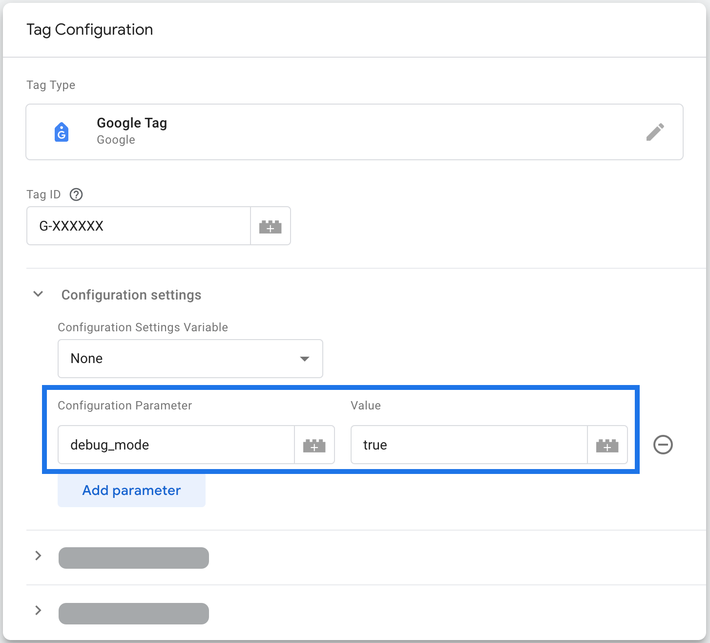
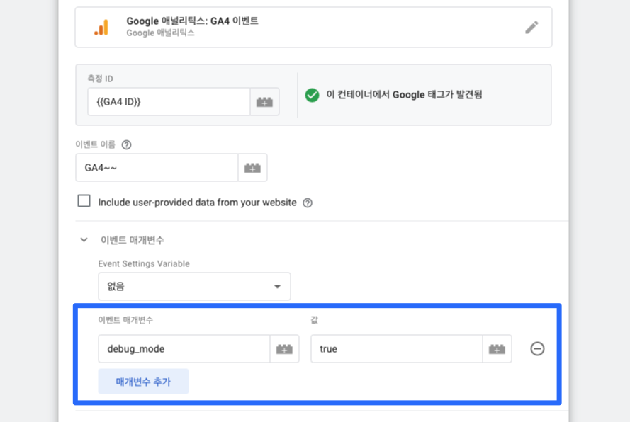
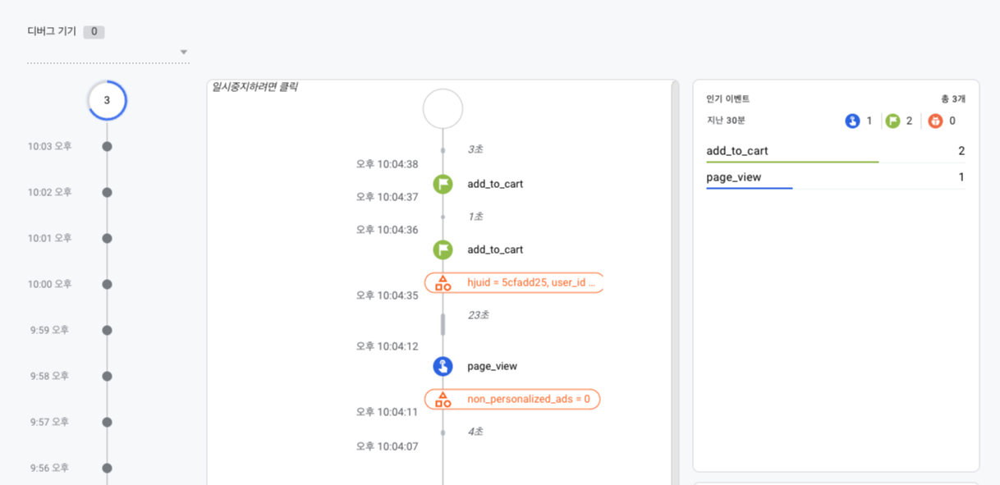

웹 사이트를 구성하다보면 웹사이트나 앱의 트래픽 및 사용자 활동을 추적하고 분석하기위해 Google Analytics 라는 도구를 사용하개 된다.   
그리고 여러 사용자 이벤트 추적을 통해 사용자의 행동 데이터를 수집하게 되는데, 데이터가 정상적으로 수집이 되고 있는지, 혹은 특정 이벤트가 울리지 않는 경우가 종종 발생한다.
이때 google analytics 이벤트를 디버깅하는 방법중에 Debug View 가 있다.

## Debug 모드 활성화 하는 방법

1. Google Tag Manager 의 미리보기 모드를 통해 발생하는 모근 이벤트가 Debug 모드가 활성화 되어 있다. 
2. 미리보기가 아닌 상태에서 모든 이벤트를 디버깅하려면, Google Tag Manager 의 Google 태그 구성 태그의 구성 매개변수에 `debug_mode` 를 `true` 로 추가한다.  

3. 미리보기가 아닌 상태에서 특정 이벤트를 디버깅하려면, Google Tag Manager 의 Google 태그 구성 태그의 구성 매개변수에 `debug_mode` 를 `true` 로 추가한다.

## Debug View
Debug 모드가 활성화 되면, Google Analytics 4 Debug View 에서 이벤트를 확인할 수 있다.

수집되는 이벤트 이름 뿐만 아니라, 해당 이벤트가 수집되었을때 파라미터, 사용자 속성 등을 함께 확인할 수 있다.

## 참고 자료
- https://support.google.com/analytics/answer/7201382?hl=en

