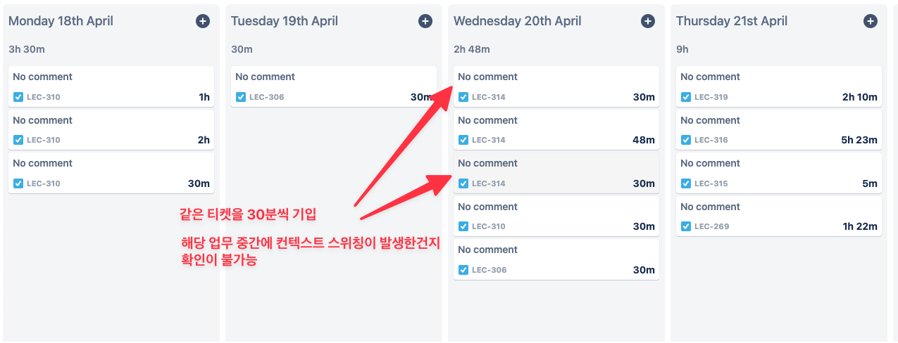

# 플러그인

## 코드 리뷰 플러그인
https://plugins.jetbrains.com/plugin/12206-new-relic-codestream-github-gitlab-prs-and-code-review
IDE 에서 바로 코드 리뷰를 달 수 있고, PR 생성도 가능하다.

그리고 나한테 온 PR 요청도 알림으로 떠서 바로 확인할 수 있다.

## 시간 추적 앱
Jira 에 시간 추적 기능을 사용하면서, 내가 해당 티켓에 소요된 시간을 주기적으로 적어야 했다.
기존에는 포모도로를 진행하면서, 30분간격으로 나의 시간을 기입했다. 
물론 이 방법도 괜찮았지만 일주일의 일하는 패턴에서 중간 인터럽트를 확인하기 어려웠다. (30분 단위로 업무를 진행했다고 표현되기 때문에)

따라서 내가 해당 티켓에 소요된 시간을 정확하게 측정할 수 있는 도구가 필요했다.

https://plugins.jetbrains.com/plugin/9286-darkyen-s-time-tracker

해당 플러그인은 실제로 내가 코드를 작성한 타입핑 기준으로 시간을 측정해준다. 따라서 해당 티켓을 처리하는데 소요된 시간을 좀 더 정확하게 기입할 수 있다.

하지만 브랜치마다 적용되는 건 아니여서 현재, 업무에 컨텍스트 스위칭이 발생했거나, 하루가 넘어가는 시점에서는 한번씩 reset time 을 입력해준다.

# 기타

## jira 연결
정리가 잘되어 있는 향로 블로그
https://jojoldu.tistory.com/260

