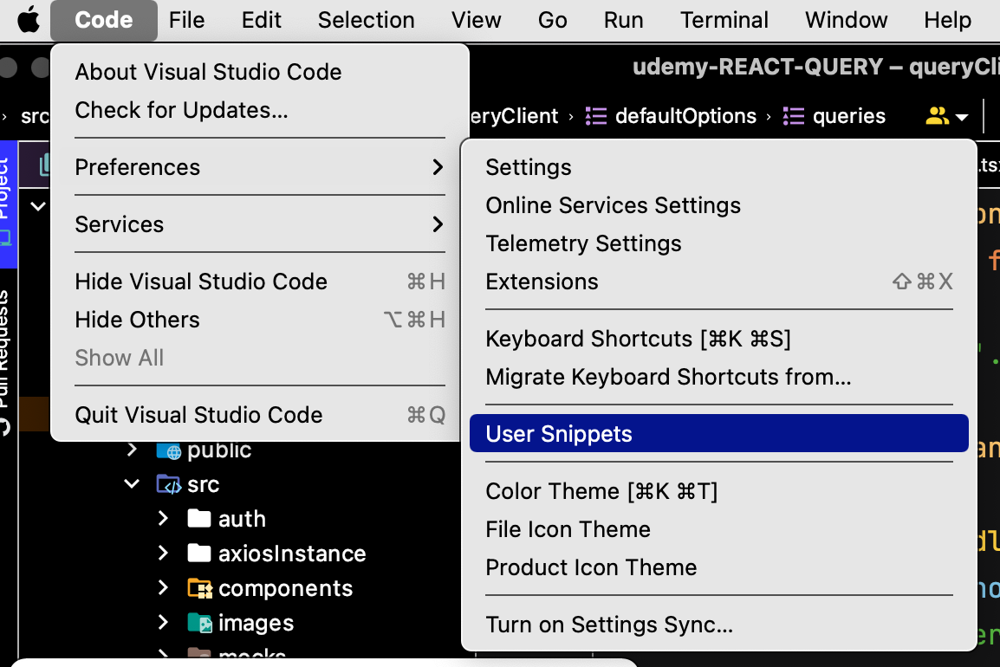

## User Snippet 추가 방법

마크다운에서 작업을 진행하다가, 스니펫을 추가해야했다.

**Code > Preferences > User snippet**



적당히 자신이 사용할 파일의 확장자 별로 추가를 해도 되고, IDE 전역으로 사용할 수 있게 해도 된다.

데일리 회고로 작성할 3fs 를 추가할 예정이여서 다음과 같이 작성했다.
```json
{
  "3fs": {
    "scope": ["markdown"], // 전역을 사용하게 셋팅했다면, 해당 snippet을 사용할 형식 지정
    "prefix": "fff", // snippet 
    "body": [ // 실제 입력 되는 텍스트
      "## $CURRENT_YEAR-$CURRENT_MONTH-$CURRENT_DATE\n",
      "### Facts\n\n",
      "### Feeling\n\n",
      "### Finding\n\n",
    ],
    "description": "Facts, Feeling, Finding" // 설명
  },
}
```

CURRENT_YEAR 같은 에디터에서 제공하는 상수도 사용 가능
https://code.visualstudio.com/docs/editor/userdefinedsnippets#_variables

```markdown
## 2022-04-10

### Facts


### Feeling


### Finding
```
👍


## markdown 파일에서 code suggestion 활성화

마크다운 작성 시 code suggestion 이 안나올 때 아래 설정을 setting.json 에 추가한다.
```json
{
  "[markdown]": {
      "editor.quickSuggestions": {
          "other": true,
          "comments": false,
          "strings": false
      }
  },
}
```


