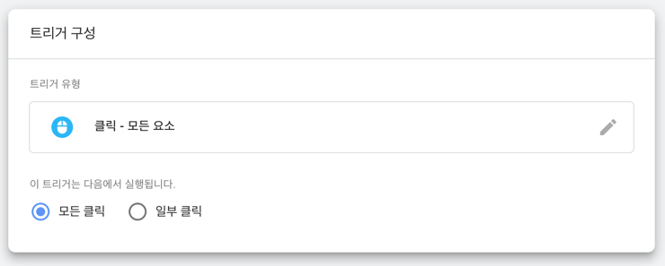

## 클릭 변수 (click variables) 가 정의되지 않은 경우

흔히 사용하는 변수 중에 `Click Element`, `Click Target` 등의 값이 있다.  
새로운 컨테이너에서 작업을 하던중 해당 변수가 `undefined` 로 잡히는 경우가 있었다.

우선 클릭 변수는 해당 트리거 중 하나가 활성화 되기전까지는 데이터를 수집하지 않는다.

1. 클릭 - 모든 요소 (All Elements)  
2. 클릭 - 링크만 (Just Links)
3. 사용자 참여 - 양식 제출 (Form Submission)
4. 사용자 참여 - 요소 공개 상태 (Element Visibility)

1 번 클릭 - 모든 요소를 사용하여 모든 요소에 클릭 트리거를 생성해놓으면 클릭 변수를 누락없이 수집할 수 있게된다.

태그 연결 필요없이 해당 트리거만 생성해두면 된다.

