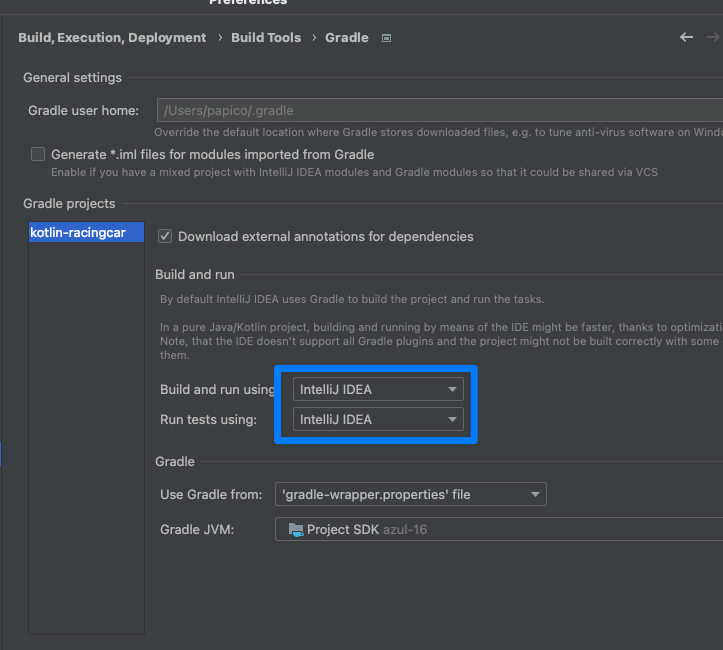
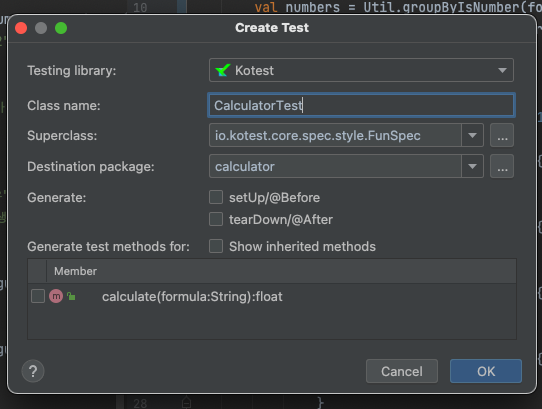
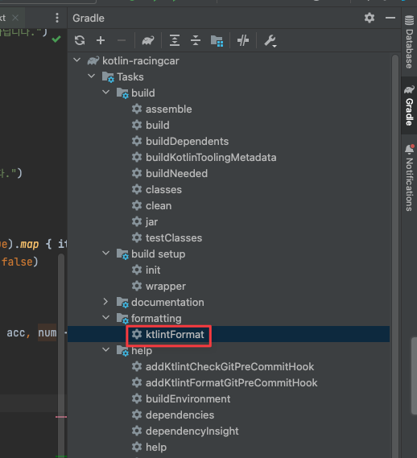

# Basic

## static 메서드 및 객체 정의  

class 내부에 `companion object` 안에 정의해준다.

```kotlin
class Util {
  companion object {
      val hello = "hello"
      fun groupByIsNumber(inputs: List<String>, bool: Boolean): List<String> {
          return inputs.groupBy { (it.toFloatOrNull() != null) }[bool]!!
      }
  }
}
```

## fold, reduce
reduce 는 초기값이 배열의 첫번째 원소, fold 는 초기값을 지정할 수 있다.  

```kotest
class ListTest : DescribeSpec({
    describe("fold") {
        listOf(1, 2, 3).fold(4) { acc, i -> acc + i } shouldBe 10
    }

    describe("reduce") {
        listOf(1, 2, 3).reduce { acc, i -> acc + i } shouldBe 6
    }
})
```

## Enum


## values

## ramda

## `?:` 연산식


## repeat 

## system io

## construct-like functions

## class 종류
data, enum, 일반

## 상수화

# Test

## shouldThrow
shouldThrow 를 통해 에러를 테스트할 수 있다.

```
describe("사칙연산 기호가 아닌 경우") {
  it("IllegalArgumentException 에러가 발생한다.") {

      val calculator = Calculator()

      val exception = shouldThrow<IllegalArgumentException> {
          calculator.calculate("4 $ 2")
      }

      exception.message shouldBe "사칙연산 기호가 아닙니다."
  }
}
```

# 알쓸신잡

## const only primitives and string are allowed
const 상수는 원시값 및 string 만 허용한다.

# IDEA

## Intellij Kotest 플러그인

Intellij 에서 kotest 를 실행시키기 위해서는 플러그인이 필요하다.

[kotest plugin](https://plugins.jetbrains.com/plugin/14080-kotest)

## Intellij kotlin 테스트 속도 높이기 

설정 -> Build, Execution, Deployment -> Build Tools -> Gradle 

기본 Gradle 로 설정되어 있는 값을 intellij 로 변경한다.

  


## 테스트 파일 단숨에 만들기
테스트를 추가하고자 하는 class 에서 `cmd + shift + t` 입력  



원하는 테스트 스펙도 정의할 수 있고, 하단에 테스트를 생성할 메서드도 정의할 수 있다.  
테스트가 생성된 이후 해당 커맨드를 입력하면 코드와 테스트 코드를 이동할 수 있게 해준다.

## ktlint 로 포맷팅하기
Gradle Toolbar -> Tasks/formatting/ktlintFormat 더블 클릭




