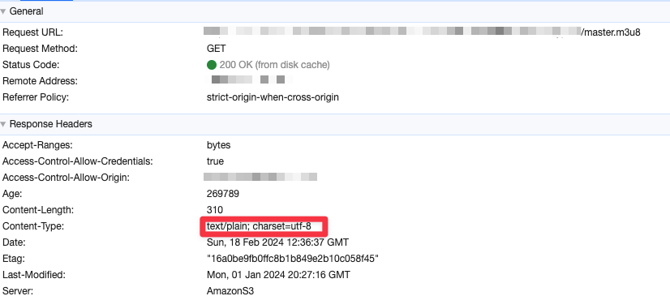

## 문제 상황

shaka-player 로 m3u8 파일을 재생하는 과정중에, Error code 4000 이 발생했다.  
해당 에러는 `UNABLE_TO_GUESS_MANIFEST_TYPE` 라는 에러로 manifest 파일의 타입을 추측할 수 없다는 에러였다.

## 해결 과정

우선 shaka player 를 통해 load 하는 메서드에서 manifest 파일의 타입을 명시적으로 지정해주었다.

```javascript
const player = new shaka.Player(videoElement);

/**
 * @param {string} uri
 * @param {number=} startTime
 * @param {string=} mimeType
 */
player.load('http://example.com/manifest.m3u8', 0, 'application/x-mpegurl');
```

에러에 대한 자세한 내용은 아래와 같다.
> The Player was unable to guess the manifest type based on file extension or MIME type. To fix, try one of the following:  
> - Rename the manifest so that the URI ends in a well-known extension.  
> - Configure the server to send a recognizable Content-Type header.  
> - Configure the server to accept a HEAD request for the manifest.  
> 
> error.data[0] is the manifest URI.

### Rename the manifest so that the URI ends in a well-known extension.
URI가 잘 알려진 확장자로 끝나도록 매니페스트의 이름을 바꿉니다. -> 이미 m3u8 확장자로 되어있음

### Configure the server to send a recognizable Content-Type header.
서버가 인식 가능한 Content-Type 헤더를 보내도록 서버를 구성합니다.


문제가 발생하는 m3u8 파일의 Content-Type 을 확인해보니 `text/plain` 으로 되어있었다.

## 해결 방법
확인해보니 s3에 업로드를 할 때, Content-Type 을 지정해서 업로드를 할 수 있다고 한다.  
이미 인코딩되어서 업로드를 했기 때문에, 해당 파일을 다시 업로드할수는 없었고, aws lambda 를 통해서 m3u8 파일의 response header 의 Content-Type 을 `application/x-mpegurl` 로 변경하는 작업을 했다.

```javascript
'use strict';

exports.handler = (event, context, callback) => {
  const response = event.Records[0].cf.response;
  
  response.headers['content-type'] = [{ key: 'Content-Type', value: 'application/x-mpegurl' }];
  
  callback(null, response);
};
```


