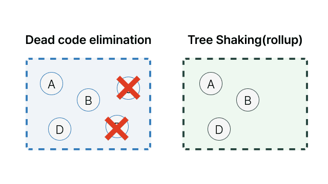

## Dead Code Elimination  
Dead Code Elimination 은 컴파일러가 프로그램 결과에 영향을 미치지 않는 코드를 제거하기 위한 컴파일러 최적화

각각의 언어마다 지원

## Tree Shaking
> tree shaking is a dead code elimination technique that is applied when optimizing code. - wikipedia  

진입점에서 시작하여 실행하여 사용하지 않는 코드를 제거하는 방식

### ESM 모듈 시스템
CommonJS 모듈 방식에서 ESM 모듈 방식으로 바뀌면서, 모듈 로딩을 정적으로 구문 분석이 가능해짐  
그에 따라 전체 종속성 트리를 추론할 수 있게 됨

## 둘의 차이점  
> Bad analogy time: imagine that you made cakes by throwing whole eggs into the mixing bowl and smashing them up, instead of cracking them open and pouring the contents out. Once the cake comes out of the oven, you remove the fragments of eggshell, except that’s quite tricky so most of the eggshell gets left in there.   
> 
> You’d probably eat less cake, for one thing.
> 
> That’s what dead code elimination consists of — taking the finished product, and imperfectly removing bits you don’t want. Tree-shaking, on the other hand, asks the opposite question: given that I want to make a cake, which bits of what ingredients do I need to include in the mixing bowl?
> 
> https://medium.com/@Rich_Harris/tree-shaking-versus-dead-code-elimination-d3765df85c80

모든 재료를 넣고 거기서 필요한 것을 골라내는 것보다, 애초에 필요한 것들을 골라서 넣는 것이 더 효율적이다.



## 부록) Next.js Modularize Imports 

많은 패키지들이 "barrel file" 을 패키지에 많이 사용한다.

```typescript jsx
import { Row, Grid as MyGrid } from 'react-bootstrap'
import { merge } from 'lodash'
```
하지만 모듈에 따라 사용하지 않는 모듈이 import 되는 케이스들이 있다.
그래서 ESM 기반으로 번들링되어 있는 모듈을 사용하여 Tree Shaking 이 되도록 하거나, 아래 코드처럼 사용하는 패키지를 특정해서 가져오는 방법을 사용하기도 한다.
```typescript jsx
import Row from 'react-bootstrap/Row'
import MyGrid from 'react-bootstrap/Grid'
import merge from 'lodash/merge'
```
Next.js 가 13 버젼으로 업데이트되면서, [modularizeImports](https://nextjs.org/docs/advanced-features/compiler#modularize-imports) 기능이 stable 되었다.


기존 [babel-plugin-transform-imports](https://www.npmjs.com/package/babel-plugin-transform-imports) 와 같은 기능을 제공하는데, 
해당 기능은 정의된 패턴을 기반으로 import 구문을 변경하는 기능을 제공한다.

**사용방법**  
```typescript jsx
module.exports = {
  modularizeImports: {
    'lodash': {
      transform: 'lodash/{{member}}',
    },
  },
};


// Before
import { merge } from 'lodash'

// After 
import merge from 'lodash/merge'
```

## 참고 문헌
- [Tree-shaking versus dead code elimination](https://medium.com/@Rich_Harris/tree-shaking-versus-dead-code-elimination-d3765df85c80)
- [Tree Shaking과 Module System](https://so-so.dev/web/tree-shaking-module-system/)
- [https://nextjs.org/docs/advanced-features/compiler#modularize-imports](https://nextjs.org/docs/advanced-features/compiler#modularize-imports)
- [https://nextjs.org/blog/next-13-1#import-resolution-for-smaller-bundles](https://nextjs.org/blog/next-13-1#import-resolution-for-smaller-bundles)


