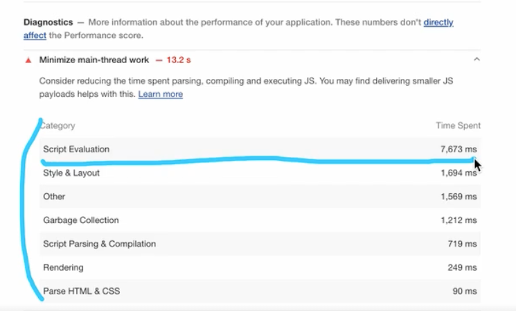
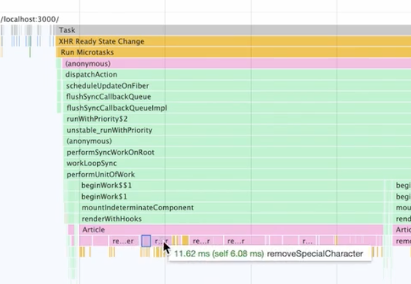
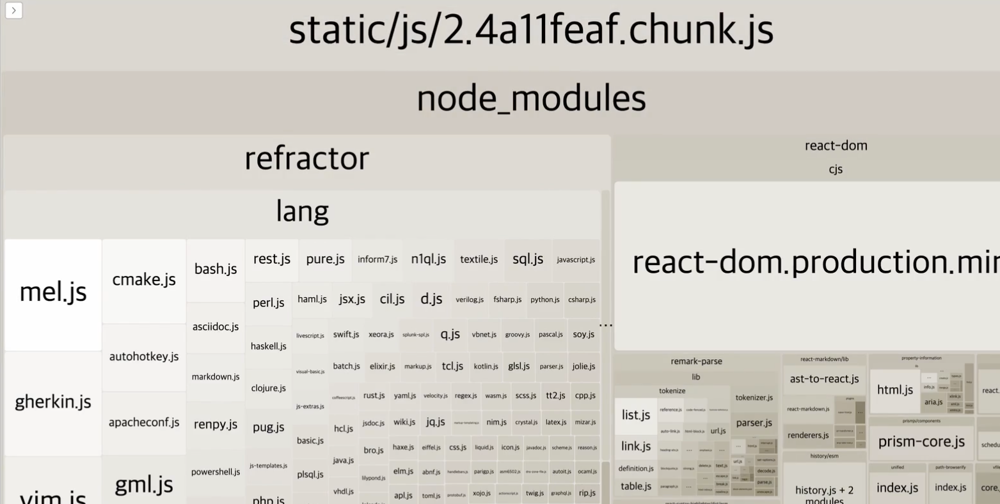
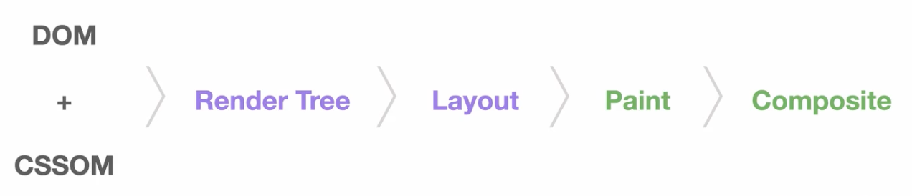
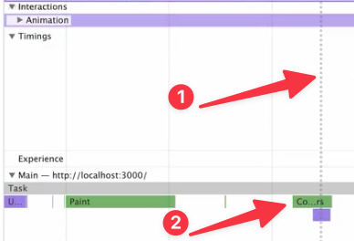

## 웹 성능을 결정하는 요소

**로딩 성능**  
각 리소스를 불러오는 성능   

**렌더링 성능**  
불러운 리소스를 화면에 보여주는 성능  

## 이미지 CDN 을 활용한 로딩 최적화  
표현하고자 하는 영역의 사이즈에 맞춰 이미지의 사이즈를 로드하면 이미지 자원을 로드하는데 드는 비용을 줄일 수 있다.  
보통 표현하는 영역의 2배정도의 사이즈를 불러오면 깨짐없이 표현할 수 있다. 

## 이미지 압축을 활용한 로딩 최적화
이미지를 압축하면 이미지 자원을 로드하는데 드는 비용을 줄일 수 있다.
png < jpg < webp 순으로 압축률이 좋다.

https://squoosh.app/

위 사이트에서 이미지를 특정 확장자로 변경하면서 압축할 수 있다. 이때 화면에 노출되는 영역의 크기에 따라 이미지를 resize 해서 압축률을 높일 수 있다. 

다만 webp 의 경우 지원하지 않는 브라우져가 있기때문에, fallback 으로 jpg 를 사용하는 것이 좋다.
```html
<picture>
    <source srcset={props.webp} type="image/webp" /> // webp 를 지원하는 브라우져에서만 사용
     // webp 로딩에 실패했을 경우 jpg 를 사용
</picture>
```

## 동영상 압축을 활용한 로딩 최적화
동영상 또한 이미지처럼 압축을 통해 로딩 성능을 최적화할 수 있다.  
다만 동영상의 경우 화질이 떨어지면 사용자 경험에 큰 영향을 미칠 수 있기 때문에, 서비스에 특성에 맞추어 적절하게 진행하면 좋다. 

이미지와 마찬가지로 webm 이라는 압축률이 좋은 확장자가 있지만, 지원하지 않는 브라우져가 있기때문에 fallback 을 고려해야한다.

```html
<video controls width="250">
  <source src="/media/cc0-videos/flower.webm" type="video/webm" />
  <source src="/media/cc0-videos/flower.mp4" type="video/mp4" />
</video>
```


## Bottleneck 코드 최적화  
LightHouse 의 Diagnostics 와, Performance 탭을 통해서 병목이 발생하는 코드를 알 수 있다.

리액크의 경우 Performance 탭에서 컴포넌트 레이어별로 렌더링 시간등을 확인할 수 있다.




위 사진에서는 Article 컴포넌트의 `removeSpecialCharactor` 함수가 오랜 시간 실행되고 있는 것을 확인할수 있다.  
그리고 함수가 실행되면서 중간중간 끊켜있는 것을 확인할 수 있는데, 이는 브라우져에서 함수를 실행하는 중간중간 메모리를 정리했기때문이다. 하단의 minor GC 를 통해 단서를 얻을 수 있다.

## 번들 파일 분석 (bundle-analyzer)
bundle-analyzer 를 통해 번들된 결과물을 분석할 수 있다.



만약 번들된 결과물에서 devDependencies 가 포함되어 있거나, 특정 페이지에서만 필요한 라이브러리가 번들에 크게 포함되고 있다면 Code Splitting 을 통해 빌드 파일을 분리할 수 있다.

## 코드 스플리팅 (Code Splitting)
코드를 분할하는 것 -> 불필요한 코드 또는 중복되는 코드가 없이 적절한 사이즈의 코드가 적절한 타이밍에 로드될 수 있도록 하는 것

**Route-based code splitting**  
https://reactjs.org/docs/code-splitting.html#route-based-code-splitting

페이지 별로 `React.lazy` 를 걸어서 특정 경로에 필요한 번들 파일만 로드할 수 있게 하는 것 또한 방법이다.  
`React.lazy` 는 반드시 `Suspense` 와 같이 사용해야한다.

**Component-based code splitting**  
모달과 같이 초기에 화면을 그리는데 필요가 없는 컴포넌트의 경우에도 코드 스플리팅을 통해 번들 파일을 분리하는 것이 가능하다.

## 컴포넌트 Preloading
Lazy Loading 의 단점 중에 하나로 분리된 번들 파일이 필요한 시점에 load 되고, 실행하는데 시간이 걸린다는 것이다.  
따라서 이를 해결하기 위해 미리 파일을 로드해두고 필요한 시점에 실행할 수 있도록 하는 방법이 Preloading 이다.  

**컴포넌트 Preload 타이밍**  
모달을 예로 들면  
1. 모달을 여는 버튼 위에 마우스를 올려놨을 때
2. 최초 페이지 로드가 되고 모든 컴포넌트의 마운트가 끝났을 때 

1번의 경우에 마우스에 올리고, 바로 클릭을 할 수도 있기때문에 modal 파일이 크다면 크게 효과가 없을 수 있다. 따라서 useEffect 훅을 사용해서 모든 컴포넌트가 마운트가 끝난 이후에 modal 관련 번들 파일을 로드하는 것이 효과적이다. 

```tsx
function lazyWithPreload(importFunction) {
    const Component = React.lazy(importFunction)
    Component.preload = importFunction
    return Component
}

const LazyImageModal = lazyWithPreload(() => import('./components/ImageModal'))

// ...
useEffect(() => {
  LazyImageModal.preload()
}, [])
```

## 이미지 Preloading
Image 오브젝트를 사용해서 필요한 이미지를 미리 로드할 수 있다.  
단 Image 오브젝트의 src 를 이용한 방법은 실행할때마다 이미지 네트워크 요청을 보내기 때문에 대상 이미지에 cache 설정이 필요하다.
미리 이미지 로드 -> 필요한 시점에 이미지 로드 (이미 캐싱된 이미지를 반환)

## 이미지 지연 Loading
이미지가 화면에 보여지는 시점에 이미지를 로드하여 아직 화면에 노출되지 않은 이미지에 대한 로딩 최적화 기법  

**Intersection Observer**
화면에 보여지는 요소를 관찰하여 특정 시점에 콜백함수를 실행하는 API  
- Observer 객체가 생성되었을 때  
- 요소가 화면에 노출되었을 때
- 요소가 화면에서 노출되었다가 사라졌을 때

```tsx
import React, { useEffect, useRef } from 'react'

function Card(props) {
  const imgRef = useRef(null);

  useEffect(() => {
    const options = {};
    const callback = (entries, observer) => {
      entries.forEach(entry => {
        if(entry.isIntersecting) {
          console.log('is intersecting', entry.target.dataset.src);
          entry.target.src = entry.target.dataset.src;
          observer.unobserve(entry.target);
        }
      });
    };
    const observer = new IntersectionObserver(callback, options);

    observer.observe(imgRef.current);
  }, [])

  return (
    <div className="Card text-center">
      
      <div className="p-5 font-semibold text-gray-700 text-xl md:text-lg lg:text-xl keep-all">
        {props.children}
      </div>
    </div>
  )
}

export default Card
```
- callback 함수의 인자로는 observe 하고 있는 요소 배열과, observer 객체가 전달된다.
- entries 는 observe 하고 있는 요소 배열이기 때문에 forEach 를 통해 순회하면서 각각의 entry 에 접근한다.
- `entry.isIntersecting` 를 통해 해당 요소가 화면에 노출되었는지를 확인할 수 있다.  
- dataset 객체를 이용해서 img 의 src 를 원하는 시점에 변경할 수 있도로 임시로 이미지 소스의 주소를 담아두었다.
- `entry.isIntersecting` 가 참이 되는 시점에 dataset 객체에 임시로 넣어둔 이미지 소스를 img.src 에 넣어준다. 
- 그리고 observer.unobserve 를 통해 해당 요소를 관찰 대상에서 제외한다. (이미지가 화면에 노출되었기 때문에 더이상 관찰할 필요가 없다.)


## 텍스트 압축 (Text Compression)
텍스트 압축을 통해 전송되는 데이터의 양을 줄일 수 있다. (로딩 성능 최적화)

Response Header 에서 `Content-Encoding: gzip` 을 통해 압축된 데이터를 전송할 수 있다.  
이때 고려해야할 점은 결국 압축한 파일을 프론트엔드에서 압축을 해제해야하기 때문에 이또한 비용이다.  
따라서 무분별하게 압축하는 것보다, 2KB 이상되는 파일을 압축하는 것이 효과적이다. 

## 애니메이션 최적화 (Animation)

**쟁크현상**  
60fps 를 유지하지 못할 때 발생. 애니메이션이 버벅이는 현상

**브라우져 렌더링 과정**


Layout: 위치나 크기를 계산    
Paint: 색을 채워 넣는 과정  
Composite: 레이어를 합치는 과정  


위에 사진처럼 1 번에 점선에는 이미 사용자에게 프레임을 노출되어야하는 시점인데 아직 2번과 같이 composite 과정이 끝나지 않았기 때문에 애니메이션이 버벅임

따라서 애니메이션 최적화는 Reflow, Repaint 과정을 줄이는데 있음 

**Reflow** : width, height (위치나 크기) 변경 -> Critical Rendering Path 전체 실행  
**Repaint** : color (색) 변경 -> Layout 과정 생략 

GPU가 관여할 수 있는 속성으로 변경해 Layout 과 Paint 과정을 생략할 수 있다. (transform, opacity)

## 폰트 최적화 (폰트 적용 시점 컨트롤 하기)
**폰트 디스플레이 방식**  
- FOUT (Flash of Unstyled Text): 기본 텍스트가 노출되다가 이후 폰트가 적용되는 방법
- FOIT (Flash of Invisible Text): 폰트가 로드될 때까지 텍스트가 노출되지 않다가 폰트가 로드된 이후에 폰트가 적용되는 방법

각각의 브라우져마다 font-display 방식이 다름

**font-display**
> The font-display descriptor for the @font-face at-rule determines how a font face is displayed based on whether and when it is downloaded and ready to use.

```
font-display: auto; // 각각의 브라우져에 설정된 기본값 따름
font-display: block; // FOIT 방식
font-display: swap; // FOUT 방식
font-display: fallback; // FOIT 방식, timeout 이후에도 폰트 로드에 실패한다면 기본 폰트를 유지하고, 이후 로드된 폰트를 캐시
font-display: optional; // FOIT 방식, fallback 과 유사하지만 네트워크 상황에 따라 브라우져가 폰트 다운로드 여부를 결정
```

서비스에 폰트가 노출되는 특성에 따라 적절한 font-display 방식을 선택  
폰트가 노출될 때 애니메이션을 추가 (체감 성능 개선)

**Font Face Observer**  
폰트가 로드되었는지를 확인할 수 있는 npm 라이브러리  
https://fontfaceobserver.com/

```tsx
const [isFontLoaded, setIsFontLoaded] = useState(false);

const font = new FontFaceObserver('FONT_NAME');

useEffect(() => {
font.load().then(function () {
  console.log('FONT_NAME has loaded');
  setIsFontLoaded(true);
});
}, []);
```

## 폰트 최적화 (사이즈 줄이기)

**웹폰트 포맷 사용**  
ttf -> woff -> woff2 순으로 압축률이 좋다.

```css
@font-face {
    font-family: BMYEONSUNG;
    src: 
       url('./assets/fonts/BMYEONSUNG.woff2') format('woff2'),
       url('./assets/fonts/BMYEONSUNG.woff') format('woff'),
       url('./assets/fonts/BMYEONSUNG.ttf') format('truetype');
    font-display: block;
}
```

**local 폰트 사용**  
사용자의 PC에 이미 폰트가 다운로드되어 있다면 폰트 다운로드 없이 해당 폰트를 사용할 수 있다.

`local('FONT_NAME')` 이라는 키워드로 명시

```css
@font-face {
    font-family: BMYEONSUNG;
    src: local('BMYEONSUNG'),
       url('./assets/fonts/BMYEONSUNG.woff2') format('woff2'),
       url('./assets/fonts/BMYEONSUNG.woff') format('woff'),
       url('./assets/fonts/BMYEONSUNG.ttf') format('truetype');
    font-display: block;
}
```
Subset 사용

Unicode Range 사용

data-uri로 변환


