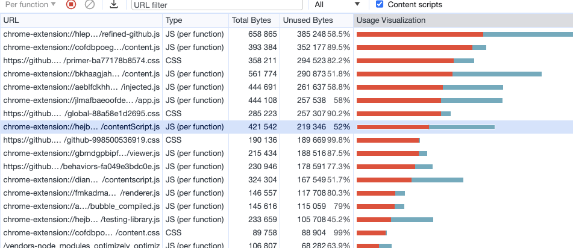

## 웹 성능을 결정하는 요소

**로딩 성능**  
각 자원을 불러오는 성능

**렌더링 성능**  
불러온 자원을 화면에 보여주는 성능

## 이미지 CDN을 활용한 로딩 최적화

표현하고자 하는 영역의 크기에 맞춰 이미지의 크기를 로드하면 이미지 자원을 로드하는데 드는 비용을 줄일 수 있다.  
보통 표현하는 영역의 2배 정도의 크기를 불러오면 깨짐 없이 표현할 수 있다.

## 이미지 압축을 활용한 로딩 최적화

이미지를 압축하면 이미지 자원을 로드하는데 드는 비용을 줄일 수 있다.
png < jpg < webp 순으로 압축률이 높다.

https://squoosh.app/

위 사이트에서 이미지를 특정 확장자로 변경하면서 압축할 수 있다. 이때 화면에 노출되는 영역의 크기에 따라 이미지를 resize 해서 압축률을 높일 수 있다.

다만 webp의 경우 지원하지 않는 브라우져가 있기 때문에, fallback으로 jpg를 사용하는 것이 좋다.

```html
<picture>
  <source srcset="{props.webp}" type="image/webp" />
  // webp 를 지원하는 브라우져에서만 사용  // webp
  로딩에 실패했을 경우 jpg 를 사용
</picture>
```

## 동영상 압축을 활용한 로딩 최적화

동영상 또한 이미지처럼 압축을 통해 로딩 성능을 최적화할 수 있다.  
다만 동영상의 경우 화질이 떨어지면 사용자 경험에 큰 영향을 미칠 수 있기 때문에, 서비스에 특성에 맞추어 적절하게 진행하면 좋다.

이미지와 마찬가지로 webm 이라는 압축률이 좋은 확장자가 있지만, 지원하지 않는 브라우져가 있기 때문에 fallback을 고려해야한다.

```html
<video controls width="250">
  <source src="/media/cc0-videos/flower.webm" type="video/webm" />
  <source src="/media/cc0-videos/flower.mp4" type="video/mp4" />
</video>
```

## Bottleneck 코드 최적화

LightHouse 의 Diagnostics 와, Performance 탭을 통해서 병목이 발생하는 코드를 알 수 있다.

리액트의 경우 Performance 탭에서 컴포넌트 계층별로 렌더링 시간 등을 확인할 수 있다.


위 사진에서는 Article 컴포넌트의 `removeSpecialCharactor` 함수가 오랜 시간 실행되고 있는 것을 확인할 수 있다.  
그리고 함수가 실행되면서 중간중간 끊겨있는 것을 확인할 수 있는데, 이는 브라우져에서 함수를 실행하는 중간중간 메모리를 정리했기 때문이다. 하단의 minor GC를 통해 단서를 얻을 수 있다.

## 번들 파일 분석 (bundle-analyzer)

bundle-analyzer를 통해 번들된 결과물을 분석할 수 있다.


만약 번들된 결과물에서 devDependencies가 포함되어 있거나, 특정 페이지에서만 필요한 라이브러리가 번들에 크게 포함되고 있다면 Code Splitting을 통해 빌드 파일을 분리할 수 있다.

## 코드 스플리팅 (Code Splitting)

코드를 분할하는 것 -> 불필요한 코드 또는 중복되는 코드가 없이 적절한 크기의 코드가 적절한 타이밍에 로드될 수 있도록 하는 것

**Route-based code splitting**  
https://reactjs.org/docs/code-splitting.html#route-based-code-splitting

페이지 별로 `React.lazy`를 걸어서 특정 경로에 필요한 번들 파일만 로드할 수 있게 하는 것 또한 방법이다.  
`React.lazy` 는 반드시 `Suspense`와 같이 사용해야 한다.

**Component-based code splitting**  
모달과 같이 초기에 화면을 그리는데 필요가 없는 컴포넌트의 경우에도 코드 스플리팅을 통해 번들 파일을 분리하는 것이 가능하다.

## 컴포넌트 Preloading

Lazy Loading 의 단점 중에 하나로 분리된 번들 파일이 필요한 시점에 load 되고, 실행하는데 시간이 걸린다는 것이다.  
따라서 이를 해결하기 위해 미리 파일을 로드해 두고 필요한 시점에 실행할 수 있도록 하는 방법이 Preloading 이다.

**컴포넌트 Preload 타이밍**  
모달을 예로 들면

1. 모달을 여는 버튼 위에 마우스를 올려놨을 때
2. 최초 페이지 로드가 되고 모든 컴포넌트의 마운트가 끝났을 때

1번의 경우에 마우스에 올리고, 바로 클릭을 할 수도 있기 때문에 modal 파일이 크다면 크게 효과가 없을 수 있다. 따라서 useEffect 훅을 사용해서 모든 컴포넌트가 마운트가 끝난 이후에 modal 관련 번들 파일을 로드하는 것이 효과적이다.

```tsx
function lazyWithPreload(importFunction) {
  const Component = React.lazy(importFunction);
  Component.preload = importFunction;
  return Component;
}

const LazyImageModal = lazyWithPreload(() => import("./components/ImageModal"));

// ...
useEffect(() => {
  LazyImageModal.preload();
}, []);
```

## 이미지 Preloading

Image 오브젝트를 사용해서 필요한 이미지를 미리 로드할 수 있다.  
단 Image 오브젝트의 src를 이용한 방법은 실행할 때마다 이미지 네트워크 요청을 보내기 때문에 대상 이미지에 cache 설정이 필요하다.
미리 이미지 로드 -> 필요한 시점에 이미지 로드 (이미 캐싱 된 이미지를 반환)

## 이미지 지연 Loading

이미지가 화면에 보이는 시점에 이미지를 로드하여 아직 화면에 노출되지 않은 이미지에 대한 로딩 최적화 기법

**Intersection Observer**
화면에 보이는 요소를 관찰하여 특정 시점에 콜백 함수를 실행하는 API

- Observer 객체가 생성되었을 때
- 요소가 화면에 노출되었을 때
- 요소가 화면에서 노출되었다가 사라졌을 때

```tsx
import React, { useEffect, useRef } from "react";

function Card(props) {
  const imgRef = useRef(null);

  useEffect(() => {
    const options = {};
    const callback = (entries, observer) => {
      entries.forEach((entry) => {
        if (entry.isIntersecting) {
          console.log("is intersecting", entry.target.dataset.src);
          entry.target.src = entry.target.dataset.src;
          observer.unobserve(entry.target);
        }
      });
    };
    const observer = new IntersectionObserver(callback, options);

    observer.observe(imgRef.current);
  }, []);

  return (
    <div className="Card text-center">
      
      <div className="p-5 font-semibold text-gray-700 text-xl md:text-lg lg:text-xl keep-all">
        {props.children}
      </div>
    </div>
  );
}

export default Card;
```

- callback 함수의 인자로는 observe 하고 있는 요소 배열과, observer 객체가 전달된다.
- entries 는 observe 하고 있는 요소 배열이기 때문에 forEach 를 통해 순회하면서 각각의 entry 에 접근한다.
- `entry.isIntersecting`를 통해 해당 요소가 화면에 노출되었는지를 확인할 수 있다.
- dataset 객체를 이용해서 img의 src를 원하는 시점에 변경할 수 있도로 임시로 이미지 소스의 주소를 담아두었다.
- `entry.isIntersecting`가 참이 되는 시점에 dataset 객체에 임시로 넣어둔 이미지 소스를 `img.src` 에 넣어준다.
- 그리고 observer.unobserve를 통해 해당 요소를 관찰 대상에서 제외한다. (이미지가 화면에 노출되었기 때문에 더 이상 관찰할 필요가 없다.)

## 텍스트 압축 (Text Compression)

텍스트 압축을 통해 전송되는 데이터의 양을 줄일 수 있다. (로딩 성능 최적화)

Response Header에서 `Content-Encoding: gzip` 을 통해 압축된 데이터를 전송할 수 있다.  
이때 고려해야 할 점은 결국 압축한 파일을 프론트엔드에서 압축을 해제해야하기 때문에 이 또한 비용이다.  
따라서 무분별하게 압축하는 것보다, 2KB 이상 되는 파일을 압축하는 것이 효과적이다.

## 애니메이션 최적화 (Animation)

**쟁크현상**  
60fps를 유지하지 못할 때 발생. 애니메이션이 버벅대는 현상

**브라우져 렌더링 과정**


Layout: 위치나 크기를 계산  
Paint: 색을 채워 넣는 과정  
Composite: 계층을 합치는 과정


위에 사진처럼 1번에 점선에는 이미 사용자에게 프레임을 노출되어야하는 시점인데 아직 2번과 같이 composite 과정이 끝나지 않았기 때문에 애니메이션이 버벅댐

따라서 애니메이션 최적화는 Reflow, Repaint 과정을 줄이는데 있음

**Reflow** : width, height (위치나 크기) 변경 -> Critical Rendering Path 전체 실행  
**Repaint** : color (색) 변경 -> Layout 과정 생략

GPU가 관여할 수 있는 속성으로 변경해 Layout 과 Paint 과정을 생략할 수 있다. (transform, opacity)

## 폰트 최적화 (폰트 적용 시점 컨트롤하기)

**폰트 디스플레이 방식**

- FOUT (Flash of Unstyled Text): 기본 텍스트가 노출되다가 이후 폰트가 적용되는 방법
- FOIT (Flash of Invisible Text): 폰트가 로드될 때까지 텍스트가 노출되지 않다가 폰트가 로드된 이후에 폰트가 적용되는 방법

각각의 브라우져마다 font-display 방식이 다름

**font-display**

> The font-display descriptor for the @font-face at-rule determines how a font face is displayed based on whether and when it is downloaded and ready to use.

```
font-display: auto; // 각각의 브라우져에 설정된 기본값 따름
font-display: block; // FOIT 방식
font-display: swap; // FOUT 방식
font-display: fallback; // FOIT 방식, timeout 이후에도 폰트 로드에 실패한다면 기본 폰트를 유지하고, 이후 로드된 폰트를 캐시
font-display: optional; // FOIT 방식, fallback과 유사하지만, 네트워크 상황에 따라 브라우져가 폰트 다운로드 여부를 결정
```

서비스에 폰트가 노출되는 특성에 따라 적절한 font-display 방식을 선택  
폰트가 노출될 때 애니메이션을 추가 (체감 성능 개선)

**Font Face Observer**  
폰트가 로드되었는지를 확인할 수 있는 npm 라이브러리  
https://fontfaceobserver.com/

```tsx
const [isFontLoaded, setIsFontLoaded] = useState(false);

const font = new FontFaceObserver("FONT_NAME");

useEffect(() => {
  font.load().then(function () {
    console.log("FONT_NAME has loaded");
    setIsFontLoaded(true);
  });
}, []);
```

## 폰트 최적화 (사이즈 줄이기)

**웹폰트 포맷 사용**  
ttf -> woff -> woff2 순으로 압축률이 높다.

[폰트압축 및 변환 사이트](https://transfonter.org/)

```css
@font-face {
  font-family: BMYEONSUNG;
  src: url("./assets/fonts/BMYEONSUNG.woff2") format("woff2"), url("./assets/fonts/BMYEONSUNG.woff")
      format("woff"), url("./assets/fonts/BMYEONSUNG.ttf") format("truetype");
  font-display: block;
}
```

**local 폰트 사용**  
사용자의 PC에 이미 폰트가 다운로드되어 있다면 폰트 다운로드 없이 해당 폰트를 사용할 수 있다.

`local('FONT_NAME')` 이라는 키워드로 명시

```css
@font-face {
  font-family: BMYEONSUNG;
  src: local("BMYEONSUNG"),
    url("./assets/fonts/BMYEONSUNG.woff2") format("woff2"), url("./assets/fonts/BMYEONSUNG.woff")
      format("woff"), url("./assets/fonts/BMYEONSUNG.ttf") format("truetype");
  font-display: block;
}
```

**Subset 사용**  
많은 폰트 중에서 서비스에 사용하는 만큼 글자를 지정해서 불러오는 방식, 폰트 변환 시 특정 문자를 지정해서 적용할 수 있다.  
지정되지 않은 텍스트의 경우 화면에서 폰트가 적용되어 있지 않은 채로 노출된다.  
Subset의 경우 화면에 지정한 폰트가 없더라도 폰트 자원을 받아오기 때문에, Unicode Range를 사용한다.

**Unicode Range 사용**  
유니코드 범위를 지정해 대상 글자만 폰트를 적용하고, 만약에 해당 글자가 존재하지 않으면 폰트 자원을 로딩하지 않는다.

**data-uri로 변환**  
페이지 자체에 폰트 데이터를 그대로 넣어서 파일을 로딩할 때 폰트 자원 관련 네트워크 요청을 보내지 않게 하는 방법도 있다.

## 폰트 프리로드 (Preload)

보통의 경우 CSS 파일을 읽은 후 해당 폰트를 사용한다고 판단되면, 그 시점에 폰트 자원을 호출한다.  
폰트 Preload 란 미리 해당 폰트가 웹사이트에서 사용된다고 명시하여, 먼저 로드할 수 있도록 해준다.

```html
<link rel="preload" href="주소" as="font" type="font/woff2" crossorigin />
```

## 캐시 최적화

lighthouse의 Diagnostics에 `Serve static assets with an efficient cache policy`  
정적 자원에 효율적인 캐시를 적용함으로써 캐시 최적화를 할 수 있다.

캐시는 데이터나 값을 미리 복사해놓는 임시 장소나 그러한 동작을 뜻한다.

**브라우져 캐시 저장 장소**

- `memory cache`: 메모리(RAM)에 자원을 저장하고 로드, 브라우져를 닫을 때까지 자원을 사용할 수 있다.
- `disk cache`: 캐시된 자원을 디스크에 저장, 로드한다.

**공유 캐시와 비공개 캐시**

- `Shared cache`: 공유 캐시, CDN이나 Proxy처럼 원본 서버와 클라이언트 사이에 존재하는 캐시, 여러 사용자에서 재사용되므로 개인화된 콘텐츠에서는 사용되어서는 안된다.
- `Private cache`: 클라이언트에 존재하는 캐시로, 로컬 캐시 혹은 브라우져 캐시라고 부른다. 단일 사용자를 위한 개인화된 콘텐츠를 저장하고 사용할 수 있다.

**Cache-Control**  
HTTP 헤더에 들어가는 값으로 만료나 방식으로 설정할 수 있다.

- `Cache-control: public`
  - 공유 캐시에 저장할 수 있음,
  - 일반적으로 페이지가 인증 상태인 경우에는 권한 부여 헤더와 함께 요청을 보내기 때문에 기본적으로 공유 캐싱이 불가능하다. 이때 `public` 을 사용하면 해당 제한을 해제할 수 있다.
  - 요청에 별도의 `Authorization` header가 없거나, `s-maxage` 혹은 `must-revalidate`를 사용하고 있다면 `public`을 사용할 필요가 없다.
- `Cache-control: private`
  - 응답을 비공개 캐시에만 저장할 수 있음
- `Cache-control: no-cache`
  - 캐시에 저장된 콘텐츠를 사용하기전에 원본 서버에 유효성 체크를 실행
  - 캐시를 사용하지 않음 이라는 뜻이 아님
- `Cache-control: no-store`
  - 캐시를 사용하지 않음
  - 모든 종류의 캐시가 해당 응답을 저장해서는 안 됨
- `Cache-control: max-age=<seconds>`
  - 응답이 생성된 후 지정한 초만큼 응답이 최신 상태로 유지됨을 나타낸다.
  - 지정한 시간은 응답을 받은 후 경과 시간이 아닌, 원본 서버에서 응답이 생성된 후 경과한 시간을 의미함
- `Cache-control: stale-while-revalidate=<seconds>`
  - 캐시의 유효성을 재검증하는 동안 기존 오래된 응답을 재사용할 수 있음을 나타냄

**Etag**  
HTTP 응답 헤더로 특정 버젼의 자원을 식별하는 식별자

## 불필요한 코드 제거

개발자 도구 하단 탭의 Coverage에서 특정 자원이 해당 페이지에서 얼마만큼 사용되었는지에 대한 정보를 얻을 수 있다.


**불필요한 css 코드 제거**

[purge css](https://purgecss.com/)는 static한 파일을 읽어 사용하지 않는 CSS를 제거해준다.
