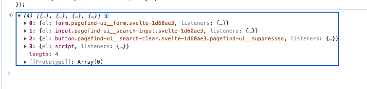

레거시 코드를 수정하다보면 내가 수정하려는 특정 페이지의 영역에 어떤 이벤트가 걸려있는지 확인하면서 수정을 해야하는 경우가 있다.  
하지만 해당 페이지에 걸려있는 모든 이벤트 코드를 확인하기는 어렵다.    
이때 `getEventListeners` 를 통해 해당 페이지에 걸려있는 이벤트 리스너를 확인할 수 있다.

## `getEventListeners`

`getEventListeners` 함수는 지정된 객체에 등록된 이벤트 리스너를 반환하는 크롬 개발자 도구의 유틸리티 API 이다. (즉, 코드레벨에서 사용하지 못한다.) 
반환 값은 등록된 각 이벤트 유형(예: 클릭 또는 키다운)에 대한 배열을 포함하는 객체입니다.

**사용법**  
```javascript
getEventListeners(document);
```

**반환 예시**  
```javascript
{
    "keydown": [
        {
            "useCapture": false,
            "passive": false,
            "once": false,
            "type": "keydown"
        }
    ],
    "click": [
        {
            "useCapture": false,
            "passive": false,
            "once": false,
            "type": "click"
        }
    ],
    "devsite-signed-in-state-updated": [
        {
            "useCapture": false,
            "passive": false,
            "once": false,
            "type": "devsite-signed-in-state-updated"
        },
        {
            "useCapture": false,
            "passive": false,
            "once": false,
            "type": "devsite-signed-in-state-updated"
        },
        {
            "useCapture": false,
            "passive": false,
            "once": false,
            "type": "devsite-signed-in-state-updated"
        },
        {
            "useCapture": false,
            "passive": false,
            "once": false,
            "type": "devsite-signed-in-state-updated"
        },
        {
            "useCapture": false,
            "passive": false,
            "once": false,
            "type": "devsite-signed-in-state-updated"
        },
        {
            "useCapture": false,
            "passive": false,
            "once": false,
            "type": "devsite-signed-in-state-updated"
        }
    ],
    "devsite-on-recommendations": [
        {
            "useCapture": false,
            "passive": false,
            "once": false,
            "type": "devsite-on-recommendations"
        }
    ],
    "synthetic-keydown": [
        {
            "useCapture": false,
            "passive": false,
            "once": false,
            "type": "synthetic-keydown"
        }
    ],
    "keyup": [
        {
            "useCapture": false,
            "passive": false,
            "once": false,
            "type": "keyup"
        }
    ],
    "synthetic-keyup": [
        {
            "useCapture": false,
            "passive": false,
            "once": false,
            "type": "synthetic-keyup"
        }
    ]
}
```


## 사용 방법

1. 크롬 개발자 도구를 열고 `[Console]` 탭으로 이동한다. (단축키: `cmd` + `option` + `j`)
2. 아래 코드를 붙여넣는다.  
```javascript
$$("*").map(el => {
  return { el, listeners: getEventListeners(el) };
}).filter(data => {
  return Object.keys(data.listeners).length;
});
```
3. 이벤트가 걸려있는 엘리먼트와 걸려있는 각각의 listeners 를 확인할 수 있다.


