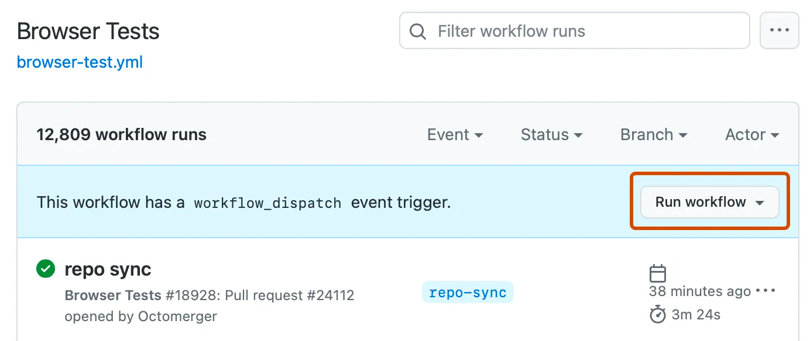

소프트웨어 개발과정에서 GitHub Actions를 활용하면 손쉽게 지속적 통합과 배포를 자동화할 수 있다. 일반적으로는 코드 저장소에 변경사항이 있을 때마다 자동으로 작업이 실행되지만, 때로는 수동으로 작업을 트리거하고 싶을 때도 있다. 

## `workflow_dispatch`

GitHub Actions에서는 `workflow_dispatch` 이벤트를 통해 수동으로 작업을 트리거할 수 있다. 또한 `inputs` 를 통해 작업을 트리거할 때 추가적인 정보를 입력받을 수 있다.

```yaml
name: depoly

on:
  workflow_dispatch:
    inputs:
      environment:
        description: '배포할 환경을 선택하세요'
        required: true
        default: 'production'
```



## github cli 를 통해서 수동으로 작업 트리거하기
`workflow_dispatch` 설정 시, github cli ([gh](https://cli.github.com/)) 로도 수동으로 작업을 트리거할 수 있다.

```bash
gh workflow run depoly --ref main -F environment=production
```


## 참고 자료
- https://docs.github.com/en/actions/using-workflows/events-that-trigger-workflows#workflow_dispatch
- https://docs.github.com/ko/actions/using-workflows/manually-running-a-workflow?tool=cli


