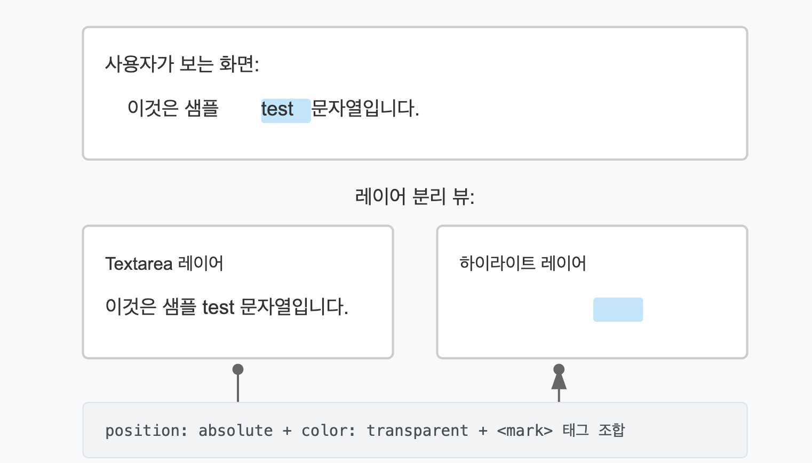

## 요구사항

1. **유저 닉네임 템플릿 삽입 기능**

    * "유저 닉네임" 버튼을 클릭하면 템플릿이 즉시 텍스트 영역에 삽입되어야 함
2. **템플릿 일괄 삭제 기능**

    * 유저 닉네임 템플릿을 제거할 때 템플릿 문자열이 한 번에 삭제되어야 함
    * 백스페이스 키를 눌렀을 때 템플릿 문자열 전체가 삭제되어야 함
3. **템플릿 하이라이트 기능**

    * 유저 닉네임 템플릿이 시각적으로 하이라이트되어 일반 텍스트와 구분되어야 함

## 구현 방식

### 1. 유저 닉네임 템플릿 삽입 기능

```tsx
const handleAddTemplate = () => {
  changeTextareaValue(value + USER_NICKNAME_TEMPLATE);
  textareaRef.current?.focus();
};
```

* 버튼 클릭 시 현재 텍스트에 템플릿 문자열을 추가
* 추가 후 텍스트 영역에 포커스를 되돌려 사용자가 계속 입력할 수 있도록 함

### 2. 템플릿 일괄 삭제 기능

```tsx
const handleTextareaKeyDown: KeyboardEventHandler<HTMLTextAreaElement> = (e) => {
  const textarea = textareaRef.current;
  if (!textarea || e.key !== 'Backspace') {
    return;
  }
  const start = textarea.selectionStart;
  const end = textarea.selectionEnd;
  if (start !== end) {
    return;
  }
  const beforeCursor = value.substring(0, start);
  if (beforeCursor.endsWith(USER_NICKNAME_TEMPLATE)) {
    const newStart = start - USER_NICKNAME_TEMPLATE.length;
    textarea.selectionStart = newStart;
    textarea.selectionEnd = start;
    const backspaceEvent = new KeyboardEvent('keydown', {
      key: 'Backspace',
      code: 'Backspace',
      bubbles: true,
      cancelable: true,
    });
    textarea.dispatchEvent(backspaceEvent);
    delay(() => {
      if (textarea) {
        textarea.selectionStart = newStart;
        textarea.selectionEnd = newStart;
      }
    }, 0);
  }
};
```

* 백스페이스 키 입력 감지
* 커서 앞에 템플릿 문자열이 있는지 확인
* 템플릿 문자열을 선택 상태로 변경
* 프로그래밍 방식으로 백스페이스 이벤트 발생시켜 선택된 템플릿 삭제
* 삭제 후 커서 위치 재조정

### 3. 템플릿 하이라이트 기능

```tsx
<Box css={{position: 'relative', overflow: 'hidden'}}>
  {/* 하이라이트 패널 레이어 */}
  <div ref={highlightRef} css={{ /* ... */}}>
    <div
      css={{
        whiteSpace: 'pre-wrap',
        wordWrap: 'break-word',
        color: 'transparent',
        mark: {
          background: COLOR_PALETTE.infgreen[2],
          color: 'transparent',
        },
      }}
      dangerouslySetInnerHTML={{__html: highlightPanelText}}
    />
  </div>
  {/* 실제 입력 레이어 */}
  <Textarea /* ... */ />
</Box>
```

```tsx
const changeHighlightPanelText = (textareaValue: string) => {
  setHighlightPanelText(
    escape(textareaValue.replace(/\n$/g, '\n\n')).replace(
      new RegExp(USER_NICKNAME_TEMPLATE, 'g'),
      `<mark>${USER_NICKNAME_TEMPLATE}</mark>`
    )
  );
};
```

* 중첩된 레이어 구조 활용 (배경 패널 + 입력 영역)
* 정규표현식으로 템플릿 문자열 감지 및 `<mark>` 태그로 변환
* CSS로 일반 텍스트는 투명하게, 마크 요소만 배경색 표시
* 스크롤 동기화를 통해 두 레이어의 텍스트 위치 일치

## 구현 과정 중 핵심 내용

### 1. 하이라이트 표현 기법

* **중첩 레이어 전략**: 실제 입력을 받는 Textarea와 하이라이트를 표시하는 배경 패널을 겹침
* **텍스트 투명화**: `color: transparent`로 배경 패널의 텍스트를 투명하게 처리하여 Textarea의 텍스트만 보이게 함
* **마크업 활용**: 템플릿 문자열을 `<mark>` 태그로 감싸서 배경색만 표시
* **스크롤 동기화**: 사용자가 텍스트 영역을 스크롤할 때 하이라이트 패널도 함께 스크롤되도록 구현



### 2. Undo/Redo 기능 보존을 위한 이벤트 디스패치

* **문제 상황**: React 상태 업데이트만으로 텍스트를 변경하면 브라우저의 Undo/Redo 기능(`Ctrl+Z`)이 작동하지 않음
* **해결 방법**: 프로그래밍 방식으로 실제 키보드 이벤트를 발생시켜 브라우저의 히스토리 스택에 기록되도록 함
* **구현 기법**:
    1. 템플릿 문자열을 선택 상태로 만듦
    2. `KeyboardEvent` 생성자로 백스페이스 이벤트 생성
    3. `dispatchEvent()`로 이벤트 발생시켜 실제 사용자 입력과 같은 효과 구현
    4. 브라우저의 내장 Undo/Redo 스택에 작업이 기록됨

## 대안 구현 방식 검토

해당 기능을 구현하기 위해 `<textarea>` 대신 `<div contenteditable>` 방식도 고려했으나, 다음과 같은 이유로 현재 방식을 선택했습니다.

### 1. Input Selection API 활용 용이성

* **장점**: `<textarea>`는 `selectionStart`, `selectionEnd` 등 기본 제공되는 Selection API가 직관적이고 사용하기 쉬움
* **단점**: `contenteditable`에서는 캐럿 위치를 복잡한 DOM 조작으로 계산하고 관리해야 함
* **결정 이유**: 문자가 변경될 때 `textarea`에서는 캐럿 위치가 자동으로 관리되어 구현 복잡도를 크게 낮춤

### 2. Mantine의 Textarea autosize 기능 활용

* **장점**: Mantine 디자인 시스템에서 제공하는 `autosize` 옵션을 그대로 활용 가능
* **단점**: `contenteditable`에서는 이 기능을 직접 구현해야 함
* **결정 이유**: 이미 검증된 라이브러리의 기능을 활용하여 개발 시간과 안정성 확보

### 3. 향후 확장성 고려사항

* 현재는 단순 하이라이트만 필요하지만, 향후 텍스트 서식(강조, 기울기 등)이 많아진다면 `contenteditable` 방식으로 마이그레이션 검토 가능
* 현재의 요구사항에는 `textarea` + 하이라이트 패널 방식이 더 간단하고 효율적이라고 판단