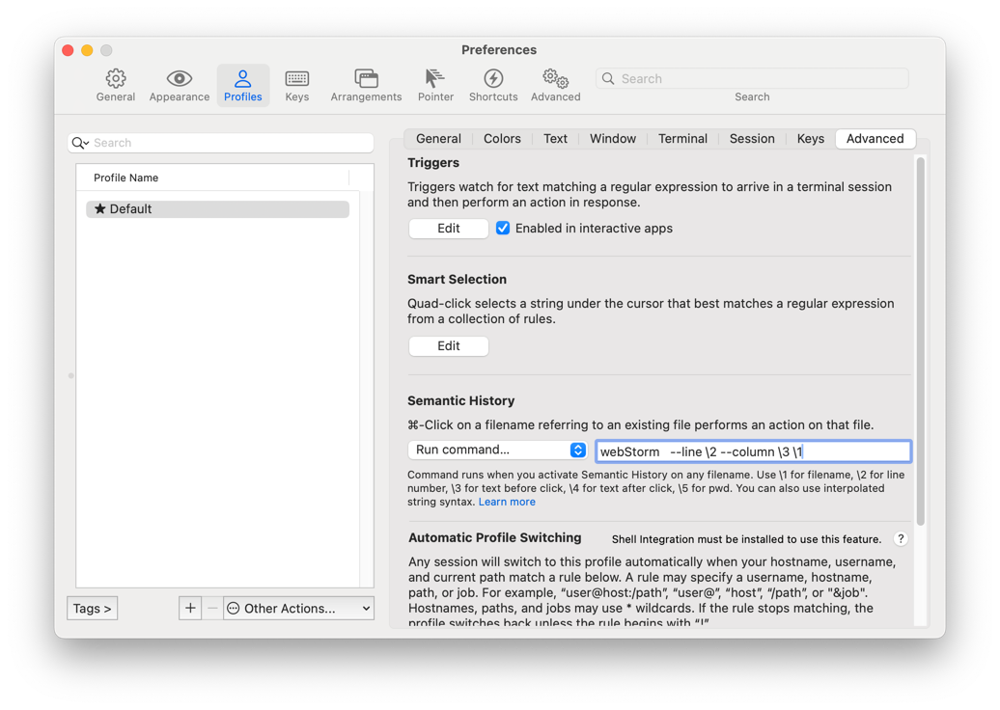

Iterm 으로 build 명령을 실행하거나, 커밋을 하는 중간에 컴파일 에러가 발생하면 문제가 일어난 파일의 라인 수가 링크로 제공된다.

```
Error: ENOENT: no such file or directory,
    at Object.statSync (node:fs:1583:3)
    at Object.statSync (/Users/papico/~~~/graceful-fs/polyfills.js:319:16)
    at Object.publish (/Users/papico/~~~/gh-pages/lib/index.js:90:13)
    at /Users/papico/~~~/gh-pages/bin/gh-pages.js:12:13
    at new Promise (<anonymous>)
```

기본적으로 해당 경로를 command + click 시에 default application 으로 열리는데, 아래 설정 시 Webstorm 에서 해당 파일을 열 수 있다. 

## 설정

[Profiles] > [Advanced] > [Semantic History] > [Run command...] 옵션 선택 후 아래 명령어 입력

```
webStorm --line \2 --column \3 \1
```




## 참고 문헌
- https://www.jetbrains.com/help/webstorm/opening-files-from-command-line.html
- https://r0k.wiki/ 주인장의 팁


