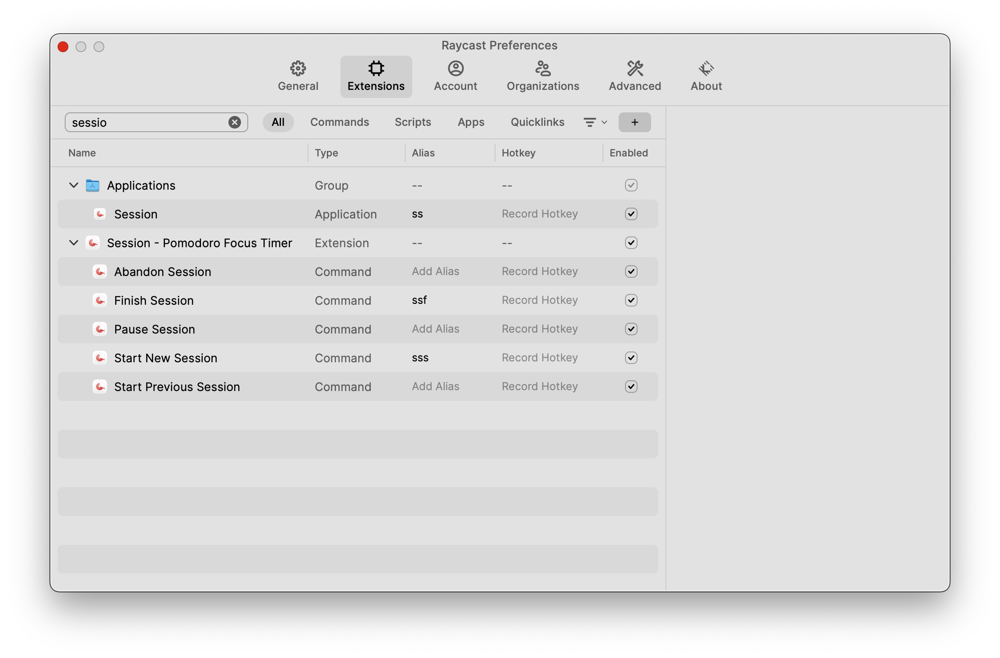
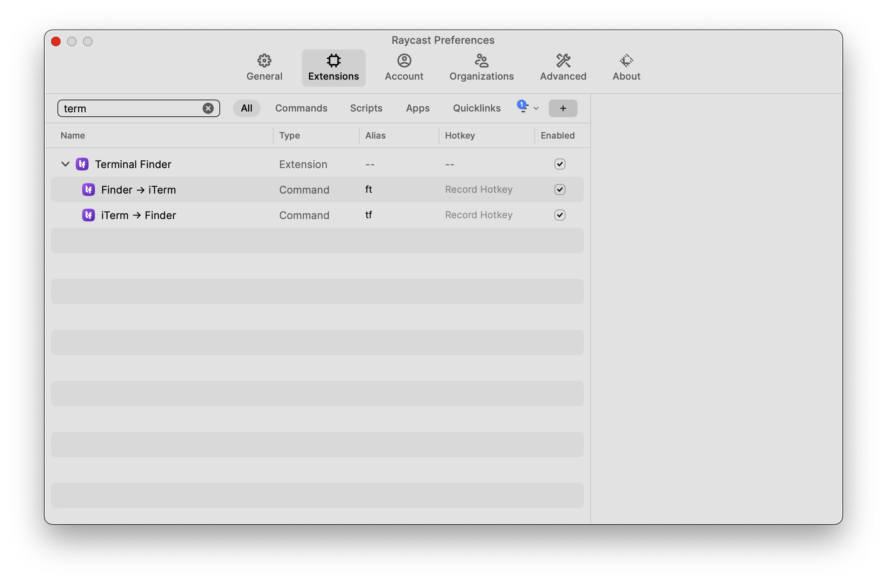
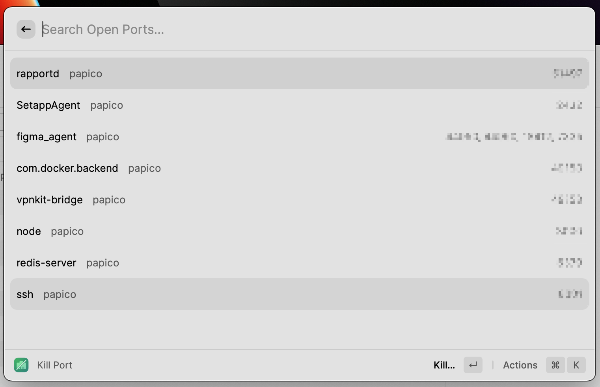
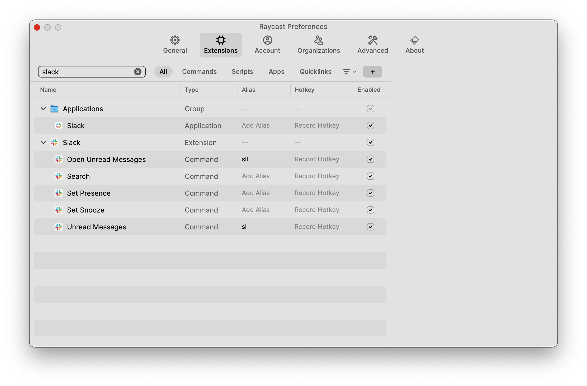
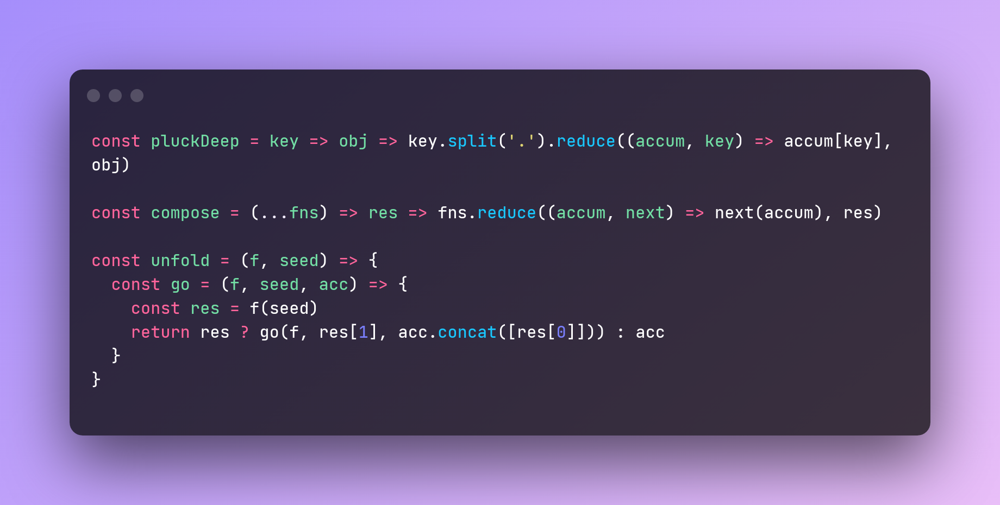
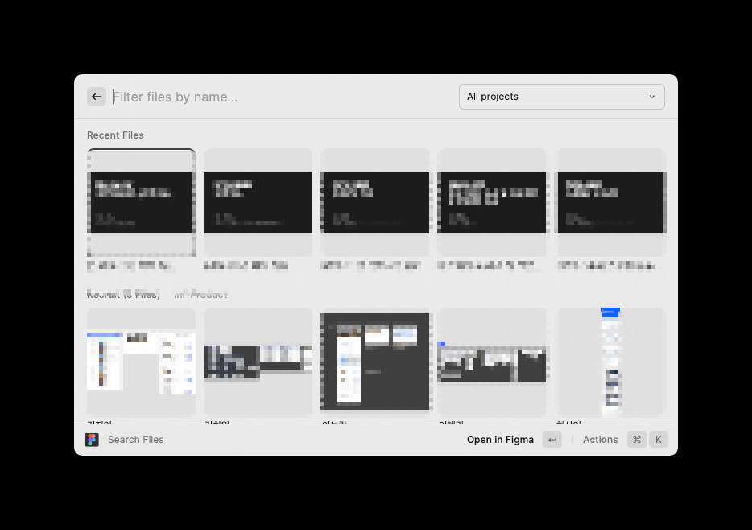

최근 Alfred 와 Jira 를 연동해보려다가 실패를 해서 이것저것 찾아보던 중 Raycast 라는 Tool 을 알게되었다.  

[설치 링크](https://www.raycast.com)

자주 사용하거나 유용한 익스텐션을 적어보겠다.

## Quicklinks

Alfred 에서 자주 사용하던 기능인데, alias 와 query 를 기반으로 등록해두면 좀 더 쉽게 원하는 페이지로 이동할 수 있다.  

|              | alias  | link                                                 |
|--------------|--------|------------------------------------------------------|
| Jira board   | `jb`   | `https://xxx.atlassian.net/browse/{Query}`           |
| Font Awesome | `fa`   | `https://fontawesome.com/search?q={Query}`           |
| Confluence   | `wiki` | `https://xxx.atlassian.net/wiki/search?text={Query}` |
| Papago       | `pa`   | `https://papago.naver.com/?sk=auto&st={Query}`       |

## File Search

현재 내 기기안에 있는 파일을 Finder 보다 빠르게 찾아준다. (기본 기능)  
자주 사용하는 기능이라 Alias 를 `[` 로 등록해두었다.

## Clipboard History 

붙여넣기 히스토리를 관리할 수 있다. (기본 기능)  
자주 사용하는 기능이라 Hotkey 로 `cmd + shift + v` 로 등록해두었다.

`Enter` 를 통해 바로 붙여넣기도 가능하고, `cmd + Enter` 를 통해 해당 텍스트를 다시 복사도 가능하다.  

## Github

[다운로드 링크](https://www.raycast.com/raycast/github)

Github 에서 제공하는 기능을 편하게 사용할 수 있도록 해준다.  
주로 global repo 검색을 많이 사용한다.

내가 관리하는 git repository 를 찾는 기능은 다른 익스텐션을 관리하는 것이 편한 것 같아 사용하지 않았다.

## Gitignore

[다운로드 링크](https://www.raycast.com/daniel-stoneuk/gitignore)

https://www.toptal.com/developers/gitignore/  

위 링크에서 제공해주는 기능을 그대로 제공한다.  
선택한 ignore 프로그램을 기반으로 .gitignore 를 만들어 클립보드에 복사해준다.  

프로젝트 초반에 가끔 이용할 것 같다.

## Google Chrome

[다운로드 링크](https://www.raycast.com/Codely/google-chrome)
검색 히스토리나 열려있는 탭들이 뭐가 있는지 검색할 수 있는 기능을 제공한다.  
개발을 하다보면 열린 탭들이 많아질때가 있는데 이때 탭이동을 수월할게 할 수 있다.

## Google Chrome Profile

[다운로드 링크](https://www.raycast.com/frouo/google-chrome-profiles)

회사 계정과 개인 구글 워크스페이스 계정이 분리되어 있거나, 개발하고 있는 서비스의 권한 별로 QA 를 진행하다보면, 크롬에 여러 구글 Profile 이 연결되어 있는 경우가 있는데, 이때 사용하면 좋다.
특정 Profile 을 선택해, 접속하고자 하는 주소를 입력하면 된다.

## Google Translate

[다운로드 링크](https://www.raycast.com/gebeto/translate)

자주 사용하는 언어 두가지를 등록해두면 두 언어 사이의 번역을 편하게 해주는 기능이다.

## Google Workspace

[다운로드 링크](https://www.raycast.com/raycast/google-workspace)

Google workspace 에서 제공하는 문서를 생성하고, 검색할 수 있는 기능을 제공한다.  
사내 공유된 문서를 검색할 때 사용하려고 했지만, 현재 드라이브에 공유된 파일만 검색이 되고 있어 사용이 불편하긴하다.  
관련해서 공유된 문서들도 검색이 되도록하는 Pull Request 가 올라가 있으니 기다리면 지원이 될 것 같다.

## Jira

[다운로드 링크](https://www.raycast.com/raycast/jira)

Jira 테스크 관리 기능을 제공한다. 특히 티켓 생성 기능이 편리하다.

## Git Repos
[다운로드 링크](https://www.raycast.com/moored/git-repos)

등록해놓은 Path 하위에 있는 .git 디렉토리를 전부 찾아준다. 

추가로 사용하는 IDE 나 터미널로 여는 기능이나, 해당 git repo 의 origin 을 여는 기능또한 지원한다. `cmd + shift + o`  

## Session
[다운로드 링크](https://www.raycast.com/jameslyons/session)

평소 업무나 개인 공부를 할때 Session 앱을 자주 사용하는데 플러그인이 있어 설치했다.

session 을 시작하거나 끝낼 수 있는 동작을 지원한다.

## Window Management

기존에 Spectacle 툴을 사용하여 원도우를 관리했었는데, raycast 에서도 동일한 기능을 지원한다.  
유사한 툴로는 Magnet, Spectacle 등등이 있다.

.png)

## Terminal Finder

[다운로드 링크](https://www.raycast.com/yedongze/terminalfinder)  
Iterm 에서 해당 경로로 Finder 를 열거나, Finder 에서 Iterm 을 열 수 있게 해준다.

## Port Manager

[다운로드 링크](https://www.raycast.com/lucaschultz/port-manager)

mac 을 사용하면서 가장 많이 검색하는 키워드중에 하나가 "mac kill port" 일 것이다.  
해당 플러그인을 사용하면 현재 열려있는 포트 리스트와 특정 포트를 kill 하는 인터페이스를 제공한다.

## Slack
[다운로드 링크](https://www.raycast.com/mommertf/slack#readme)

회사에서 메신저로 Slack 를 사용하고 있다면 유용하다.
반드시 확인해야하는 메세지나 채널 (페이지 모니터링 채널 등...) 은 `Unread Messages` 에 채널을 등록해서 수시로 확인하고,

`Open Unread Messages` 를 단축키로 등록해, 포모도로가 한 세션 끝날때 마다 확인하고 있다.

## ray.so
[다운로드 링크](https://www.raycast.com/garrett/ray-so)

소스 코드를 이미지화 해준다. 비슷한 사이트로는 [Carbon](https://carbon.now.sh) 이라는 웹사이트가 있다.  
이미지화 할 소스코드에 드래그해서 커서를 만든 후, `Create Image From Code` 를 선택하면 된다.  
아래는 해당 실행의 결과물이다.

## Lorem Ipsum  
[다운로드 링크](https://www.raycast.com/AntonNiklasson/lorem-ipsum)

가끔 lorem 이 필요할 때 가볍게 사용할 수 있다.

## Figma file search
[다운로드 링크](https://www.raycast.com/michaelschultz/figma-files-raycast-extension)

회사에서 Figma 를 디자인 툴로 사용하고 있다면 유용하다. 프로젝트 검색 및 최근 수정한 파일에 쉽게 접근할 수 있다.

