최근 Alfred 와 Jira 를 연동해보려다가 실패를 해서 이것저것 찾아보던 중 Raycast 라는 Tool 을 알게되었다.  

기존에 Spotlight 를 자주 사용한 맥 유저라면 한 번 사용해보는 것을 추천드린다.

그 중 자주 사용하거나 유용한 익스텐션을 추천해보겠다.

## File Search
현재 내 기기안에 있는 파일을 Finder 보다 빠르게 찾아준다.  
자주 사용하는 기능이라 Alias 를 `[` 로 등록해두었다.

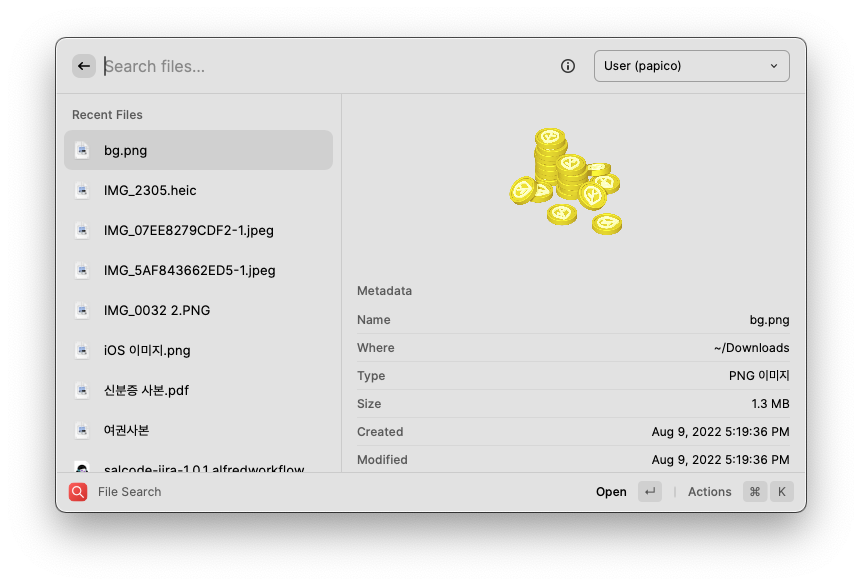

## Clipboard History
붙여넣기 히스토리를 관리할 수 있다.  
자주 사용하는 기능이라 Hotkey 로 `cmd + shift + v` 로 등록해두었다.

`Enter` 를 통해 바로 붙여넣기도 가능하고, `cmd + Enter` 를 통해 해당 텍스트를 다시 복사도 가능하다.  

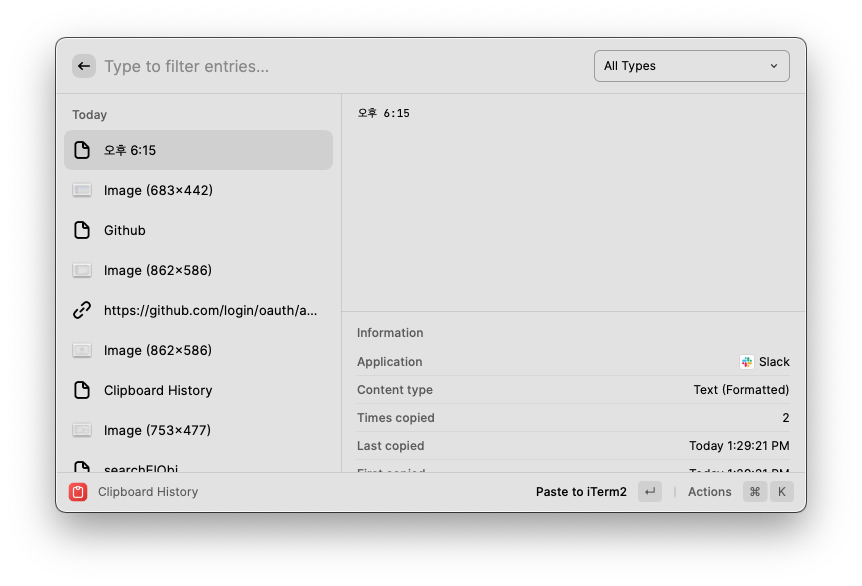

## Github
Github 에서 제공하는 기능을 편하게 사용할 수 있도록 해준다.  
주로 global repo 검색을 많이 사용한다.

내가 관리하는 git repository 를 찾는 기능은 다른 익스텐션을 관리하는 것이 편한 것 같아 사용하지 않았다.

해당 플러그인의 단점은 자신의 private repo 는 접근할 수 없다는 점...  

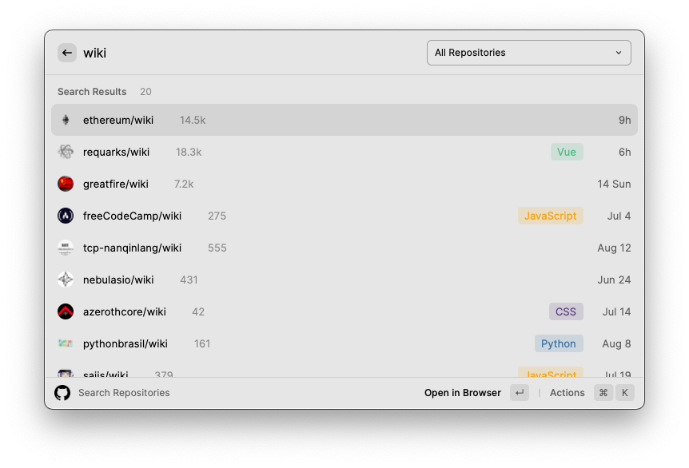

## Gitignore

https://www.toptal.com/developers/gitignore/  

위 링크에서 제공해주는 기능을 그대로 제공한다.  
선택한 ignore 프로그램을 기반으로 .gitignore 를 만들어 클립보드에 복사해준다.  

프로젝트 초반에 가끔 이용할 것 같다.

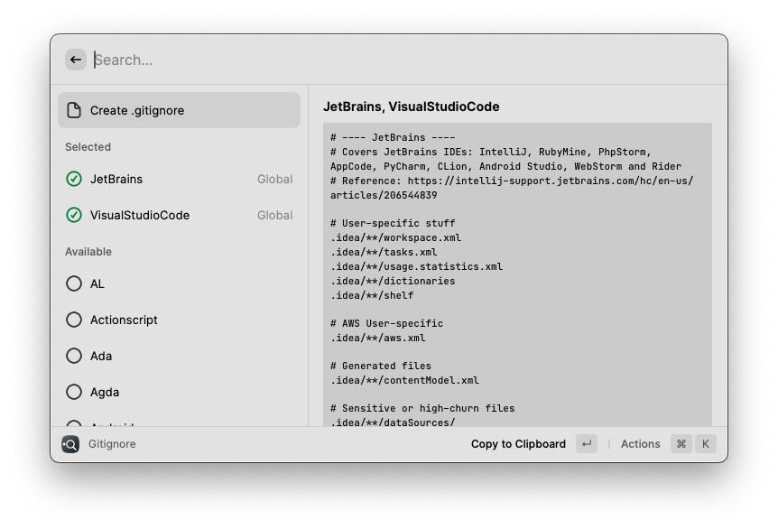

## Google Chrome
검색 히스토리나 열려있는 탭들이 뭐가 있는지 검색할 수 있는 기능을 제공한다.  
개발을 하다보면 열린 탭들이 많아질때가 있는데 이때 탭이동을 수월할게 할 수 있다.

자주 사용하는 기능이라 Alias 를 `tab` 으로 등록해두었다.

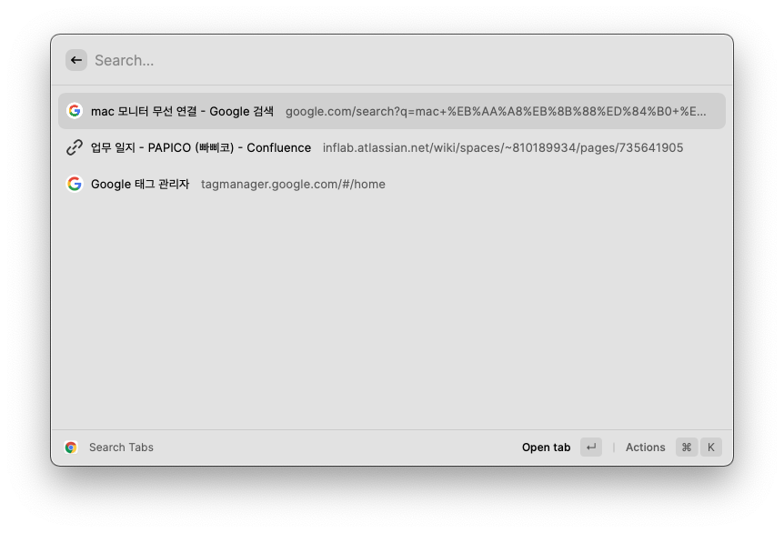

## Google Translate
자주 사용하는 언어 두가지를 등록해두면 두 언어 사이의 번역을 편하게 해주는 기능이다.

자주 사용하는 기능이라 Alias 를 `pa` 으로 등록해두었다.

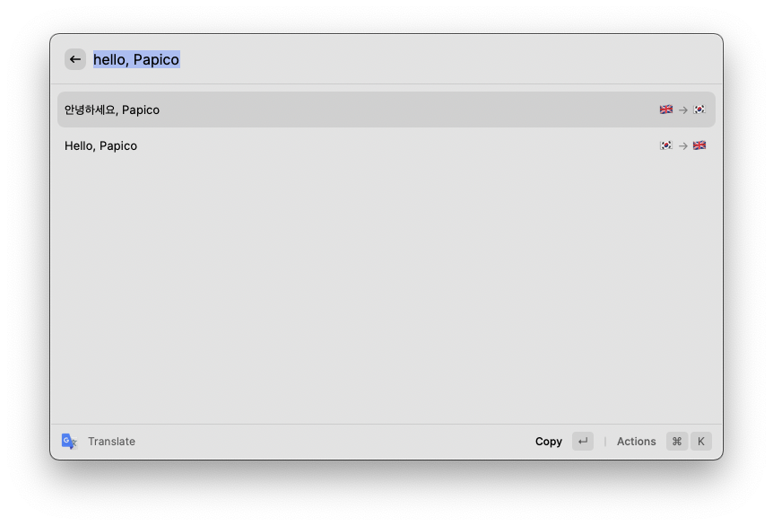

## Google Workspace

Google workspace 에서 제공하는 문서를 생성하고, 검색할 수 있는 기능을 제공한다.

사내 공유된 문서를 검색할 때 사용하려고 했지만, 현재 드라이브에 공유된 파일만 검색이 되고 있어 사용이 불편하긴하다.

관련해서 공유된 문서들도 검색이 되도록하는 Pull Request 가 올라가 있으니 기다리면 지원이 될 것 같다...!

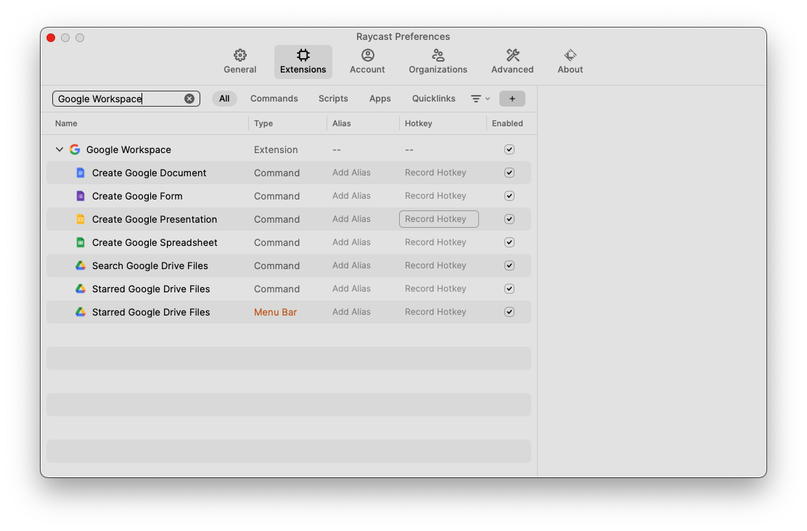

## Jira
Jira 테스크 관리 기능을 제공한다.

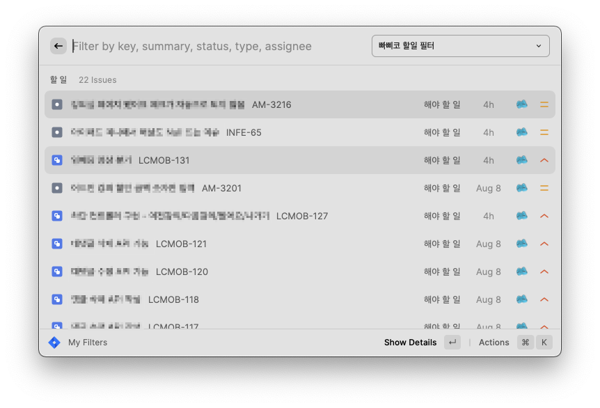

자주 사용하는 기능을 Alias 로 설정해 사용중이다.

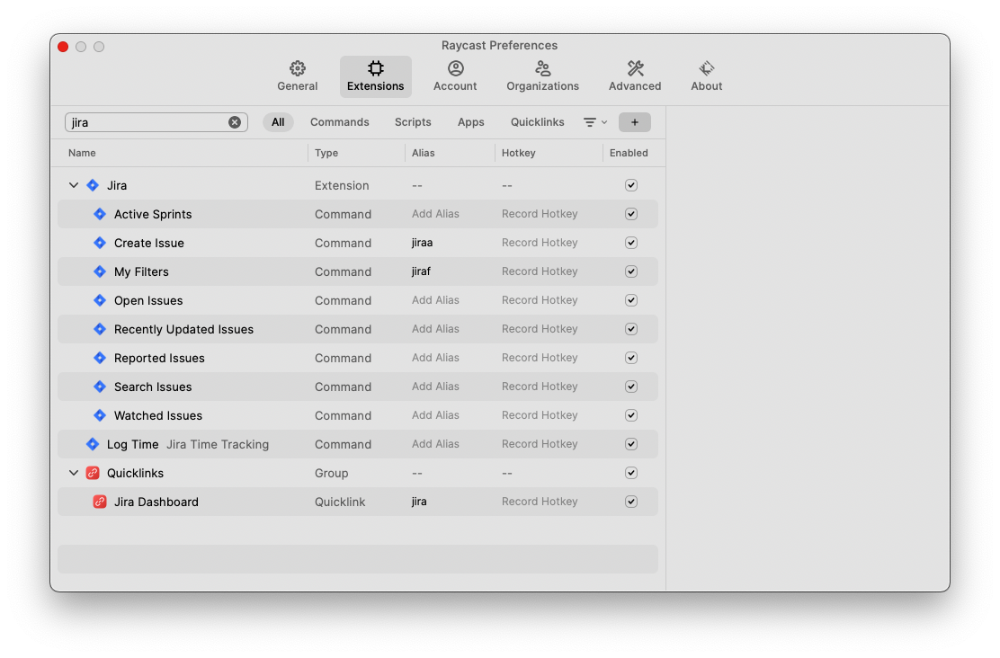

## List Repos
등록해놓은 Path 하위에 있는 git 디렉토리를 전부 찾아준다.  

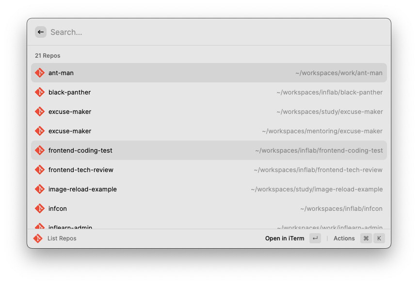

추가로 사용하는 IDE 나 터미널로 여는 기능이나, 해당 git repo 의 origin 을 여는 기능또한 지원한다. `cmd + shift + o`  
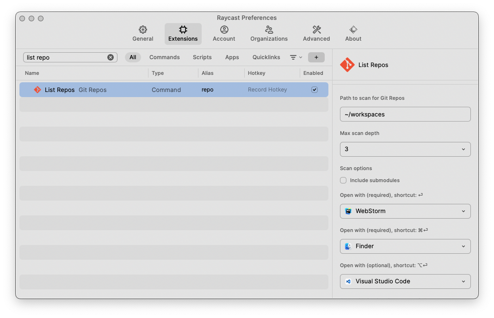

## Manage Services

## JetBrains

## Confluence Search

## Session

## Window Management

## Terminal Finder
